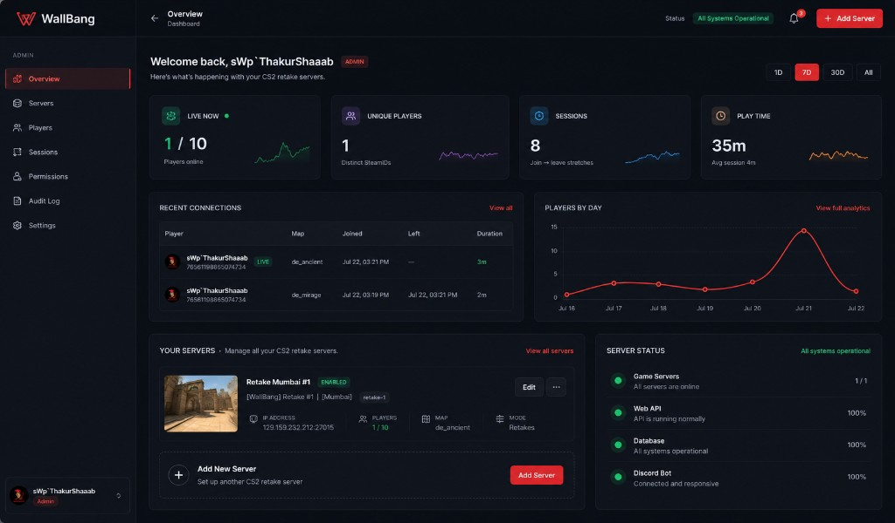

# WallBang Admin Panel Redesign Plan

**Branch:** `redesign/admin-panel`  
**Date:** 2026-07-22  
**Target vision:** [`mockups/overview-target.png`](./mockups/overview-target.png)

This document is the baseline for redesigning the website admin panel. It follows five phases: inventory → workflows → competitive patterns → IA/wireframes → implementation & rollout.

---

## 1. Inventory — Current UI & Data Flows

### 1.1 What exists today

The live admin surface is minimal compared to the target mockup. There is **no left sidebar**. Navigation is two top tabs under the marketing `SiteHeader`.

| Route | Page title | Primary component | Status |
|---|---|---|---|
| `/admin` | Permissions | `AdminDashboard` | Shipped |
| `/admin/servers` | Servers | `AdminServersPanel` (Activity + Manage tabs) | Shipped |
| `/admin` Overview / Dashboard | — | — | **Missing** (mockup only) |
| `/admin/players` | — | — | **Missing** |
| `/admin/sessions` | — | — | **Missing** (data lives under Servers → Activity) |
| `/admin/audit` | — | — | **Missing** (embedded table on Permissions) |
| `/admin/settings` | — | — | **Missing** |

**Access gate** (`app/(admin)/layout.tsx`):

1. `featureFlags.adminPanel`
2. Steam session + Mongo configured
3. Permission `admin_panel` (ADMIN / OWNER roles)

---

### 1.2 Screen-by-screen component inventory

#### A. Permissions — `/admin`

| UI component | Type | Data source |
|---|---|---|
| Search input + Search button | Filter / action | `GET /api/v1/users?q=` |
| Search results list (avatar, name, SteamID, role) | List | same |
| Selected user card | Detail panel | `GET /api/v1/users?steamId=` → `ResolvedPermissions` |
| Active roles list + Remove | List + action | `POST /api/v1/admin/revoke-role` |
| Effective permissions chips | Read-only tags | derived from selected payload |
| Grant role form (role, source, expiry) | Form | `POST /api/v1/admin/grant-role` |
| Audit log table (last ~40) | Table | `GET /api/v1/admin/audit?limit=40` |

**Not wired in UI:** `POST /api/v1/admin/grant-badge` exists but has no admin screen.

#### B. Servers — `/admin/servers`

**Shell:** Activity | Manage tabs + Refresh list → `GET /api/v1/admin/servers`

**Activity tab** (`ServerStatsDashboard`):

| UI component | Type | Data source |
|---|---|---|
| Server select | Filter | servers list from parent |
| Range chips: 1d / 7d / 30d / all | Filter | query param `range` |
| KPI cards: Unique players, Sessions, Play time, Live now | Summary cards | `GET /api/v1/admin/server-stats` |
| Players-by-day bars | Chart (CSS bars) | `daily[]` in same response |
| Recent connections table | Table | `recent[]` in same response |

**Manage tab** (`ServerManageDashboard`):

| UI component | Type | Data source |
|---|---|---|
| Fleet table (name, address, flags) | Table | `GET /api/v1/admin/servers` |
| Enable / Disable | Action | `DELETE` (soft) or `PATCH` |
| Create / Edit form | Form | `POST` / `PATCH /api/v1/admin/servers[/:id]` |

---

### 1.3 API inventory (`/api/v1/admin/*` + related)

| Endpoint | Methods | Permission | Feeds |
|---|---|---|---|
| `/api/v1/admin/audit` | GET | `admin_panel` | Audit table |
| `/api/v1/admin/grant-role` | POST | `manage_users` | Grant form |
| `/api/v1/admin/revoke-role` | POST | `manage_users` | Remove role |
| `/api/v1/admin/grant-badge` | POST | `manage_users` | **No UI** |
| `/api/v1/admin/servers` | GET, POST | `admin_panel` / `manage_servers` | Fleet + picker |
| `/api/v1/admin/servers/[id]` | PATCH, DELETE | `manage_servers` | Edit / soft-disable |
| `/api/v1/admin/server-stats` | GET | `admin_panel` | Activity KPIs / chart / sessions |
| `/api/v1/users` | GET | `manage_users` | Search + resolve |
| `/api/v1/presence` | POST/GET | plugin API key | Writes sessions/presence (indirect) |
| `/api/servers` | GET | public | A2S live counts used inside server-stats |
| `/api/health` | GET | public | **Not used by admin UI** |

Envelope: `{ ok: true, data }` | `{ ok: false, error }`.

---

### 1.4 Data flow map

```
┌─────────────────────────────────────────────────────────────────┐
│ CS2 Presence Plugin                                             │
│   POST /api/v1/presence  →  player_presence + player_sessions   │
└───────────────────────────────┬─────────────────────────────────┘
                                │
┌───────────────────────────────▼─────────────────────────────────┐
│ MongoDB (wallbang)                                              │
│  users · user_roles · roles · permissions · audit_logs          │
│  game_servers · player_sessions · player_presence · player_badges│
└───────┬───────────────────────────────┬─────────────────────────┘
        │                               │
        ▼                               ▼
 /admin (Permissions)            /admin/servers
  users + grant/revoke            servers CRUD
  + audit_logs                    + server-stats
                                  (+ A2S via /api/servers)
```

**Collections that matter for redesign:**

| Collection | Purpose |
|---|---|
| `users` | Identity, display role |
| `user_roles` / `roles` / `permissions` | RBAC |
| `audit_logs` | GRANT_ROLE / REVOKE_ROLE only today |
| `game_servers` | Fleet registry |
| `player_sessions` | Connection history |
| `player_presence` | Live online counts |
| `player_badges` | Badge grants (API only) |

---

### 1.5 Gap analysis (shipped vs mockup)

| Mockup item | Today | Preserve / build |
|---|---|---|
| Sidebar IA (7 sections) | 2 top tabs | **Build** new shell |
| Overview KPIs + chart + recent + fleet cards + health | Partial KPIs only under Servers → Activity (per-server) | **Promote** to fleet-wide Overview; keep per-server drill-down |
| Servers card grid + Add Server | Manage table + form | **Redesign** presentation; keep CRUD |
| Players directory | Search only inside Permissions | **Extract** player search/browse page |
| Sessions page | Embedded recent table | **Extract** dedicated sessions view |
| Permissions | Full grant/revoke UX | **Preserve** logic; restyle into new shell |
| Audit Log page | Embedded 40-row table | **Extract**; extend action coverage |
| Settings | None | **New** (feature flags, owners, health) |
| Notifications bell | None | **Defer** (needs event model) |
| System health strip | `/api/health` unused | **New** composite health endpoint |
| Badge grant UI | API only | **Add** to Permissions or Players |

**Preserve as valuable (do not drop):**

- Role grant/revoke with source + expiry
- Effective permissions resolution (roles → perms, never payments)
- Soft-disable server semantics
- Session aggregation from presence heartbeats
- Audit trail for role changes
- Permission gating (`admin_panel` vs `manage_users` vs `manage_servers`)

**Outdated / redundant candidates:**

- Top-tab-only nav (replace with sidebar shell)
- CSS bar chart (upgrade to proper line chart matching mockup)
- Audit embedded only under Permissions (split for scanability)
- Activity locked behind a per-server select with no fleet rollup

---

## 2. User Workflows & Task Analysis

### 2.1 Personas (inferred from RBAC + product)

No Hotjar / GA / Mixpanel is wired for the admin panel today. Prioritization below is from **permission model, code paths, and operator duties** — treat as hypotheses to validate with the 1–3 people who actually use `/admin`.

| Persona | Roles | Primary goals |
|---|---|---|
| **Owner** | OWNER | Fleet health, VIP/Founding grants, server CRUD, audit review |
| **Admin** | ADMIN | Same as Owner minus OWNER-only edge cases; day-to-day ops |
| **Moderator** | MODERATOR | In-game kick/mute/slay/map — **no** `admin_panel` today |
| **Support-style** | future | Look up player sessions / roles without server CRUD |

### 2.2 Top tasks (importance × frequency)

| Priority | Task | Steps today | Target home |
|---|---|---|---|
| P0 | Check if servers are up & who is online | Servers → Activity → pick server | **Overview** KPIs + health |
| P0 | Grant / revoke VIP or staff role | Permissions → search → grant/remove | **Permissions** |
| P0 | Add / edit / disable a game server | Servers → Manage → form | **Servers** |
| P1 | Review who connected recently | Servers → Activity → table | **Overview** + **Sessions** |
| P1 | Investigate a player’s roles / history | Permissions search + audit scroll | **Players** + **Audit** |
| P2 | Review audit of role changes | Bottom of Permissions | **Audit Log** |
| P2 | Grant website badge | API only / manual | **Players** or Permissions |
| P3 | Panel / env settings | Not available | **Settings** |
| Later | Kick / ban from web | Permissions exist for in-game only | Out of MVP (RCON/plugin) |

### 2.3 Task flows to optimize

**A. Morning check (highest frequency)**

```
Login → Overview (fleet live, 7d unique, recent connections, health)
      → optional drill: Servers or Sessions
```

**B. Grant VIP**

```
Permissions → search SteamID/name → select → Grant (VIP, source, expiry) → confirm in audit
```

**C. Onboard new CS2 box**

```
Servers → Add Server → fill host/port/mode → Enabled → verify on Overview / public /servers
```

### 2.4 Research backlog (do before locking IA)

1. 15-minute interview with each active admin: last 5 tasks they performed in panel.
2. One week of lightweight event logging: `admin_page_view`, `admin_grant_role`, `admin_server_save` (server-side only is enough).
3. Confirm whether Moderators should get a **read-only** or **limited** panel (today they cannot enter).

---

## 3. Competitive Patterns & UI Benchmarks

### 3.1 CS2 / game-server panels

| Product | Patterns worth adopting | Avoid for WallBang MVP |
|---|---|---|
| **Quatrix** | Multi-instance dashboard, range analytics, ACL, live player list | Full RCON/file manager scope |
| **CS2-WebPlus** | Role tiers, mobile-ready ops, status-first home | One-click reinstall / FTP / MySQL tools |
| **Defuse / Nokit** | Clean RCON + live logs, multi-server switcher | Host-process control (we are registry + presence, not hoster) |
| **Unilan** | Server **cards** with map/players/mode on overview | Event-calendar / LAN-specific chrome |

### 3.2 SaaS admin norms (Grafana / Datadog / Shopify Admin / cloud consoles)

- Persistent **left nav** + page title/breadcrumb
- **KPI strip above the fold**, details below
- Global time range that cascades to charts/tables
- Primary CTA in header (`+ Add Server`)
- Tables with “View all” → dedicated list routes
- Consistent filters (search, range, status) in the same place on every list page
- Charts: **line** for trends over time, **bars** for category compare, sparklines on KPIs

### 3.3 Design principles for this redesign

1. **Observation vs action** — Overview is read-mostly; Permissions / Servers are write-heavy (Fyle-style separation).
2. **Fleet-first, then drill-down** — mockup Overview aggregates; per-server detail stays one click away.
3. **Same shell everywhere** — sidebar, header status, user chip; content changes only.
4. **Reuse existing APIs first** — wrap fleet rollups rather than invent parallel data models.
5. **Stay in brand** — dark surface, red accent from mockup; avoid generic purple SaaS look. Match WallBang marketing tokens where possible.

---

## 4. Information Architecture & Wireframes

### 4.1 Sitemap (target)

```
/admin                      Overview (default)
/admin/servers              Fleet list + create/edit
/admin/servers/[id]         Optional detail (stats + edit) — phase 2
/admin/players              Search / directory
/admin/players/[steamId]    Player detail (roles, sessions, badges) — phase 2
/admin/sessions             Cross-server recent sessions
/admin/permissions          Role grant/revoke (move from /admin)
/admin/audit                Full audit log
/admin/settings             Panel & ops settings
```

**Redirect:** `/admin` today = Permissions → after redesign, `/admin` = Overview; Permissions moves to `/admin/permissions` with a permanent redirect from old mental model if needed.

### 4.2 Navigation IA

```
ADMIN
├── Overview          admin_panel
├── Servers           admin_panel (write: manage_servers)
├── Players           manage_users (or admin_panel read-only later)
├── Sessions          admin_panel
├── Permissions       manage_users
├── Audit Log         admin_panel
└── Settings          OWNER (or manage_servers + admin_panel)
```

Hide nav items the user lacks permission for (progressive disclosure).

### 4.3 Low-fi wireframes

#### Overview (`/admin`) — matches mockup hierarchy

```
┌──────────┬──────────────────────────────────────────────────────────┐
│ Brand    │ Overview / Dashboard     [Status]  [bell]  [+ Add Server]│
│          ├──────────────────────────────────────────────────────────┤
│ Overview │ Welcome, {name}                          [1D][7D][30D][All]
│ Servers  │ ┌─────┐ ┌─────┐ ┌─────┐ ┌─────┐                          │
│ Players  │ │LIVE │ │UNIQ │ │SESS │ │TIME │   KPI row                 │
│ Sessions │ └─────┘ └─────┘ └─────┘ └─────┘                          │
│ Perms    │ ┌ Recent connections ──────┐ ┌ Players by day (line) ──┐ │
│ Audit    │ │ table …          View all│ │ chart …     Full analytics│ │
│ Settings │ └──────────────────────────┘ └──────────────────────────┘ │
│          │ ┌ Your servers (cards) ────┐ ┌ Server status ──────────┐ │
│ [avatar] │ │ card | + Add             │ │ Game / API / DB / Bot   │ │
└──────────┴─┴──────────────────────────┴─┴─────────────────────────┴─┘
```

#### Servers

```
Header: Servers                    [+ Add Server]
Filters: status (all/enabled) · search
Grid or table of server cards → Edit opens drawer/page
```

#### Players

```
Search SteamID / name
Results table: avatar, name, SteamID, display role, last login
Row click → detail (roles + recent sessions + grant badge)
```

#### Sessions

```
Filters: server · range · active-only
Table: player, server, map, joined, left, duration, LIVE badge
```

#### Permissions

```
Keep current two-column UX (search | detail+grant), restyled into shell
Remove embedded audit (link to Audit Log)
```

#### Audit Log

```
Filters: action · admin · target · date
Paginated table (not hard-capped at 40)
```

#### Settings (MVP)

```
Read-only: feature flags snapshot, Mongo health, owner SteamIDs count
Write later: notification prefs, retention windows
```

### 4.4 Interaction notes

- Global range on Overview syncs KPIs + chart + recent window.
- “View all” on recent connections → `/admin/sessions`.
- “View all servers” / server card → `/admin/servers` or `/admin/servers/[id]`.
- “+ Add Server” in header → `/admin/servers?new=1` (opens create form).
- Mobile: sidebar collapses to drawer; KPI grid → 2×2; tables horizontal scroll.

### 4.5 Prototype validation checklist

- [ ] Owner can complete morning check without leaving Overview
- [ ] Grant VIP still ≤ 4 clicks from login
- [ ] User without `manage_users` never sees Permissions write UI
- [ ] Deep links work (`/admin/permissions`, `/admin/sessions`)
- [ ] Staging feedback from ≥1 other admin before prod

---

## 5. Implementation Plan, APIs & Rollout

### 5.1 Stack (keep)

| Layer | Choice |
|---|---|
| Framework | Next.js 15 App Router (existing) |
| UI | Existing shadcn / Base UI + Tailwind tokens |
| Charts | Add lightweight lib (e.g. Recharts) for line/sparklines — or SVG |
| AuthZ | Existing `requirePermission` / `hasPermission` |
| DB | MongoDB collections as today |

No GraphQL needed for MVP; extend REST consistently.

### 5.2 API design — reuse + extend

#### Keep as-is

- `GET/POST /api/v1/admin/servers`, `PATCH/DELETE .../[id]`
- `POST grant-role` / `revoke-role` / `grant-badge`
- `GET /api/v1/users`
- `GET /api/v1/admin/audit` (add pagination + filters)

#### New / extended endpoints

| Endpoint | Purpose | Notes |
|---|---|---|
| `GET /api/v1/admin/overview?range=` | Fleet rollup for Overview | Aggregate sessions across servers; reuse `getServerConnectionStats` patterns |
| `GET /api/v1/admin/sessions?serverId&range&cursor&limit&active=` | Sessions page | Paginated `player_sessions` join users |
| `GET /api/v1/admin/health` | Game servers / API / DB / Discord bot status | Compose A2S + Mongo ping + bot heartbeat if available |
| `GET /api/v1/admin/audit?action&q&cursor&limit&from&to` | Full audit | Cursor pagination; default 50 |
| `GET /api/v1/admin/players?q&role&cursor` | Optional dedicated players list | Or keep using `/api/v1/users` |

**Conventions:** cursor pagination, zod validation, permission checks, stable `{ ok, data }` envelope, ISO timestamps.

#### Audit coverage gaps to close

Today only `GRANT_ROLE` / `REVOKE_ROLE`. Add audit (or structured ops log) for:

- Server create / update / disable
- Badge grant
- (Future) settings changes

### 5.3 Frontend delivery — file plan

```
app/(admin)/
  layout.tsx                 → AdminShell (sidebar) instead of SiteHeader-only
  admin/page.tsx             → Overview
  admin/servers/page.tsx     → Servers (redesign)
  admin/players/page.tsx     → new
  admin/sessions/page.tsx    → new
  admin/permissions/page.tsx → move AdminDashboard
  admin/audit/page.tsx       → new
  admin/settings/page.tsx    → new

components/admin/
  admin-shell.tsx            → sidebar + header
  overview-dashboard.tsx     → new
  … existing panels refactored into shell
```

### 5.4 Sprint plan

| Sprint | Deliverable | Exit criteria |
|---|---|---|
| **S0** | This plan + branch + confirm IA with stakeholders | Signed-off sitemap |
| **S1** | Admin shell (sidebar, header, status placeholder, responsive) | All existing pages render inside shell; redirects for Permissions |
| **S2** | Overview page wired to new `overview` + `health` APIs | Matches mockup structure with real data |
| **S3** | Servers card/list redesign; Add Server CTA parity | CRUD parity with today |
| **S4** | Sessions + Players pages; Permissions moved; Audit extracted | No feature regression on grant/revoke |
| **S5** | Settings MVP; badge grant UI; audit for server CRUD | QA checklist green on staging |
| **S6** | Polish (charts, empty states, a11y), prod rollout | Error monitoring quiet for 48h |

### 5.5 Testing strategy

| Layer | What |
|---|---|
| Unit | Zod schemas, duration formatters, range bucketing |
| Integration | API permission matrix (401/403/200) for each admin route |
| UI | Playwright/manual: grant role, create server, overview filters |
| a11y | Keyboard nav for sidebar, table headers, form labels |
| Regression | Public `/servers` and presence plugin unaffected |

**Pre-launch QA checklist**

- [ ] Unauthenticated `/admin*` → redirect `/`
- [ ] User without `admin_panel` → redirect `/`
- [ ] `manage_users` missing → cannot grant; search blocked
- [ ] `manage_servers` missing → cannot create/edit
- [ ] Overview range filters update KPIs/chart/table
- [ ] Soft-disable server removes from public featured paths as today
- [ ] Mobile sidebar + tables usable
- [ ] Staging (`wallbang-oc`) smoke before prod (`wallbang-hostinger`)

### 5.6 Rollout

1. Develop on `redesign/admin-panel`.
2. Deploy to **staging** (`wallbang-oc`); owners dogfood for ≥3 days.
3. Feature-flag optional: keep `adminPanel` on; if needed add `adminPanelV2` for shell-only.
4. Prod deploy (`wallbang-hostinger`); watch API 4xx/5xx and Discord ops channel.
5. Post-launch: short survey + optional page-view counters to re-rank backlog (notifications, RCON, live player actions).

### 5.7 Explicit non-goals (MVP)

- In-browser RCON / kick-ban UI (permissions exist for game plugin, not web)
- Hotjar / full product analytics suite
- Notification center with real events (bell can be stubbed or hidden until event bus exists)
- GraphQL Admin API

---

## Appendix A — Current vs target route map

| Current | Target |
|---|---|
| `/admin` (Permissions) | `/admin/permissions` |
| `/admin/servers` | `/admin/servers` (redesigned) |
| — | `/admin` Overview |
| — | `/admin/players` |
| — | `/admin/sessions` |
| — | `/admin/audit` |
| — | `/admin/settings` |

## Appendix B — Permission matrix (panel)

| Capability | USER | VIP | FM | MOD | ADMIN | OWNER |
|---|---|---|---|---|---|---|
| Enter panel (`admin_panel`) | | | | | ✓ | ✓ |
| Manage users / roles | | | | | ✓ | ✓ |
| Manage servers | | | | | ✓ | ✓ |
| In-game kick/mute/… | | | | ✓ | ✓ | ✓ |

## Appendix C — Reference mockup



---

*Next action: stakeholder review of §4 IA, then Sprint 1 (Admin shell).*

---

## Implementation status (2026-07-22)

Shipped on `redesign/admin-panel`:

- Admin shell (sidebar + header + mobile drawer + health badge)
- Routes: Overview, Servers, Players, Sessions, Permissions, Audit, Settings
- APIs: `GET /api/v1/admin/overview`, `/health`, `/sessions`
- Overview dashboard wired to fleet rollup + health checks
- Permissions moved to `/admin/permissions` (audit extracted)

Remaining polish: richer Servers card UI on Manage tab, badge grant UI, audit for server CRUD, notifications.
