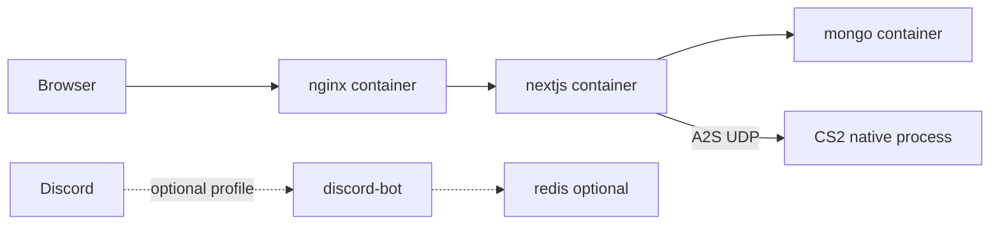

# Hostinger KVM2 production deploy (executive summary)

Target host: Hostinger KVM2 (2 vCPU / 8 GB) running native CS2 beside the Docker web stack.

```text
/home/wallbang/
├── wallbang-cs2-server/     # native CS2 — not managed by Compose
└── wallbang-xyz/            # this repo (Next.js + mongo + nginx; redis optional)
```

## Architecture



## One-shot bootstrap

```bash
git clone git@github.com:spratap124/wallbang-xyz.git /home/wallbang/wallbang-xyz
cd /home/wallbang/wallbang-xyz
bash scripts/hostinger-bootstrap.sh
```

## Manual start

```bash
cp .env.production.example .env
# set MONGO_PASSWORD and matching MONGODB_URI password
docker compose -f docker-compose.prod.yml --env-file .env up -d --build
curl -fsS http://127.0.0.1:3000/api/health
curl -fsS http://127.0.0.1:3000/api/servers | jq
```

## TLS

1. Point DNS A records for `wallbang.xyz` / `www` at the VPS IP.
2. Issue certs (host certbot webroot into `certbot/www`, or Cloudflare DNS-01).
3. Place `fullchain.pem` + `privkey.pem` in `nginx/certs/wallbang.xyz/`.
4. Ensure the TLS vhost is active (`nginx/conf.d/wallbang.conf` in git is TLS by default):

```bash
git checkout -- nginx/conf.d/wallbang.conf
docker compose -f docker-compose.prod.yml exec nginx nginx -s reload
```

5. Auto-renew: point certbot’s deploy hook at [`scripts/renew-certs.sh`](../scripts/renew-certs.sh):

```bash
sudo ln -sf "$(pwd)/scripts/renew-certs.sh" /etc/letsencrypt/renewal-hooks/deploy/wallbang-nginx
sudo certbot renew --dry-run
```

First-boot HTTP-only config lives at `nginx/conf.d/wallbang.http.conf.example`.

## CI/CD

GitHub Actions:

- [`.github/workflows/ci.yml`](../.github/workflows/ci.yml) — lint/typecheck/`next build` on PRs and pushes; SSH deploy to Hostinger only after a green build on `main` (manual `workflow_dispatch` also deploys `main` only)

Required repo secrets (set in GitHub; do not commit values):

| Secret | Description |
|---|---|
| `VPS_HOST` | Hostinger VPS public IP |
| `VPS_USER` | SSH user (e.g. `ubuntu`) |
| `VPS_SSH_KEY` | Private key whose public half is in `~/.ssh/authorized_keys` on the VPS |

Deploy path on the VPS: `/home/ubuntu/wallbang-xyz` (uses `github.com-xyz` remote + `docker compose -f docker-compose.prod.yml`).


## Backups

```bash
./scripts/backup_db.sh
sudo ln -sf "$(pwd)/scripts/backup_db.sh" /etc/cron.daily/wallbang-db-backup
./scripts/restore_db.sh backups/db/mongo_YYYYMMDD_HHMMSS.archive.gz
```

## Optional profiles

```bash
# Watchtower auto-updates
docker compose -f docker-compose.prod.yml --profile watchtower --env-file .env up -d

# Discord bot (requires ./discord-bot app + DISCORD_BOT_TOKEN)
docker compose -f docker-compose.prod.yml --profile discord --env-file .env up -d
```

## Runbook

| Task | Command |
|---|---|
| Deploy / update | `git pull && docker compose -f docker-compose.prod.yml --env-file .env up -d --build` |
| Logs | `docker logs -f wallbang-next` |
| Rollback | `git checkout <prev-sha> && docker compose -f docker-compose.prod.yml --env-file .env up -d --build` |
| Health | `curl -fsS http://127.0.0.1:3000/api/health` |

## Security checklist

- UFW: 22/tcp, 80/tcp, 443/tcp, 27015–27020/udp
- SSH key-only (`PasswordAuthentication no`)
- Fail2Ban enabled (bootstrap installs it)
- Containers run as non-root (`wallbang` user in Next.js image)
- Do not commit `.env`

## MongoDB Atlas alternative

Compose defaults to the in-stack `db` service. To use Atlas instead, set `MONGODB_URI` / `MONGODB_DB` in `.env` to your Atlas SRV string (and you may stop the local `db` service later if unused).

**Dev vs prod:** use two Atlas databases (same cluster is fine) — `wallbang_dev` in local `.env.local`, `wallbang` on the VPS `.env`. Never point local at the prod DB.
