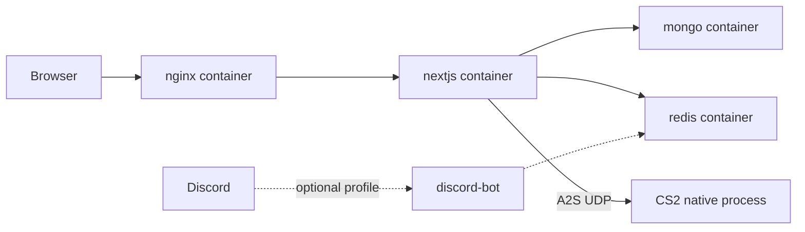

# Hostinger KVM2 production deploy (executive summary)

Target host: Hostinger KVM2 (2 vCPU / 8 GB) running native CS2 beside the Docker web stack.

```text
/home/wallbang/
├── wallbang-cs2-server/     # native CS2 — not managed by Compose
└── wallbang-xyz/            # this repo (Next.js + mongo + redis + nginx)
```

## Architecture



## One-shot bootstrap

```bash
git clone git@github.com:spratap124/wallbang-xyz.git /home/wallbang/wallbang-xyz
cd /home/wallbang/wallbang-xyz
bash scripts/hostinger-bootstrap.sh
```

## Manual start

```bash
cp .env.production.example .env
# set MONGO_PASSWORD and matching MONGODB_URI password
docker compose -f docker-compose.prod.yml --env-file .env up -d --build
curl -fsS http://127.0.0.1:3000/api/health
curl -fsS http://127.0.0.1:3000/api/servers | jq
```

## TLS

1. Point DNS A records for `wallbang.xyz` / `www` at the VPS IP.
2. Issue certs (host certbot webroot into `certbot/www`, or Cloudflare DNS-01).
3. Place `fullchain.pem` + `privkey.pem` in `nginx/certs/wallbang.xyz/`.
4. Enable SSL vhost:

```bash
cp nginx/conf.d/wallbang.ssl.conf.example nginx/conf.d/wallbang.conf
docker compose -f docker-compose.prod.yml exec nginx nginx -s reload
```

## CI/CD

GitHub Actions [`.github/workflows/deploy.yml`](../.github/workflows/deploy.yml) deploys on push to `main`.

Required repo secrets:

| Secret | Value |
|---|---|
| `VPS_HOST` | VPS public IP / hostname |
| `VPS_USER` | SSH user (e.g. `wallbang` or `ubuntu`) |
| `VPS_SSH_KEY` | Private key with deploy access |

## Backups

```bash
./scripts/backup_db.sh
sudo ln -sf "$(pwd)/scripts/backup_db.sh" /etc/cron.daily/wallbang-db-backup
./scripts/restore_db.sh backups/db/mongo_YYYYMMDD_HHMMSS.archive.gz
```

## Optional profiles

```bash
# Watchtower auto-updates
docker compose -f docker-compose.prod.yml --profile watchtower --env-file .env up -d

# Discord bot (requires ./discord-bot app + DISCORD_BOT_TOKEN)
docker compose -f docker-compose.prod.yml --profile discord --env-file .env up -d
```

## Runbook

| Task | Command |
|---|---|
| Deploy / update | `git pull && docker compose -f docker-compose.prod.yml --env-file .env up -d --build` |
| Logs | `docker logs -f wallbang-next` |
| Rollback | `git checkout <prev-sha> && docker compose -f docker-compose.prod.yml --env-file .env up -d --build` |
| Health | `curl -fsS http://127.0.0.1:3000/api/health` |

## Security checklist

- UFW: 22/tcp, 80/tcp, 443/tcp, 27015–27020/udp
- SSH key-only (`PasswordAuthentication no`)
- Fail2Ban enabled (bootstrap installs it)
- Containers run as non-root (`wallbang` user in Next.js image)
- Do not commit `.env`

## MongoDB Atlas alternative

Compose defaults to the in-stack `db` service. To use Atlas instead, set `MONGODB_URI` in `.env` to your Atlas SRV string (and you may stop the local `db` service later if unused).
